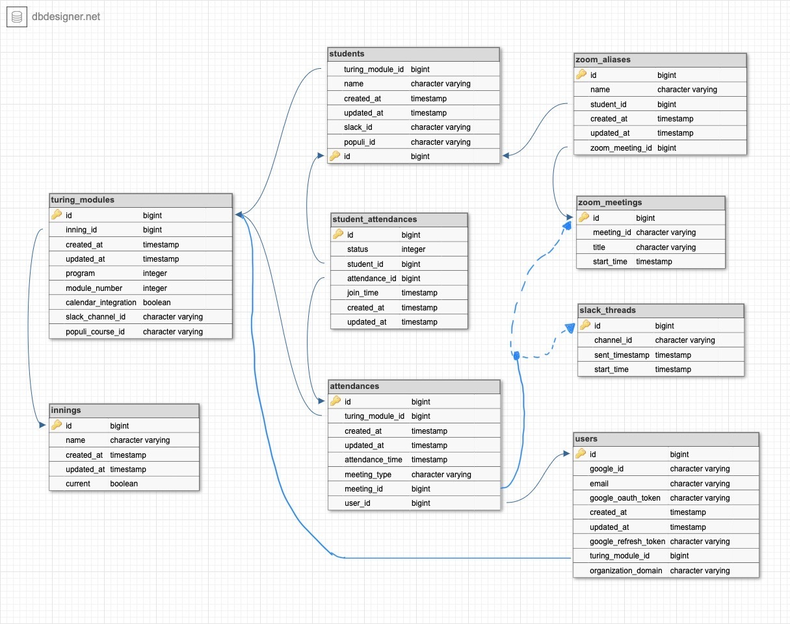

# Present

Manage Turing student attendances.

[Deployed Here](https://present.turing.edu/)

## Local Setup

### Prerequisites

The rest of the setup assumes you have the following installed in your local environment.

* Ruby 3.1.4. We recommend [RBenv](https://github.com/rbenv/rbenv) for managing your Ruby version.
* Rails 7.0.4.3
* Postgresql
* Bundler 2.3.7
* Google Chrome 116.0
* Redis 7.0.11

Other versions may work. If you wish to test other versions you will have to modify the `Gemfile`, remove `Gemfile.lock` and run `bundle install`.

### Running the Test Suite

First, clone this repo and run the following commands.

```
bundle install
rails db:create
rails db:migrate
bundle exec rspec
```

You should have all passing tests. If you do not, make sure you have met the prerequisites.

### Environment Variables

To run locally you will need to set up some environment variables. This project includes [Figaro](https://github.com/laserlemon/figaro) in its Bundler environment and can be used to set up environment variables.

To setup up Figaro, run

```
bundle exec figaro install
```

Then, open the file `config/application.yml` and enter your environment variables. If you are an active developer on this project, you can find these credentials pinned in the Present Development Slack channel.

Otherwise, you can copy and paste the following template into the file:

```
GOOGLE_OAUTH_CLIENT_ID: <YOUR_GOOGLE_OAUTH_CLIENT_ID_HERE>
GOOGLE_OAUTH_CLIENT_SECRET: <YOUR_GOOGLE_OAUTH_CLIENT_SECRET_HERE>
ZOOM_ACCOUNT_ID: <YOUR_ZOOM_ACCOUNT_ID>
ZOOM_CLIENT_ID: <YOUR_ZOOM_CLIENT_ID>
ZOOM_CLIENT_SECRET: <YOUR_ZOOM_CLIENT_SECRET>
slack_api_key: <YOUR_SLACK_API_KEY_HERE>
POPULI_API_ACCESS_KEY: <YOUR_POPULI_API_KEY_HERE>
POPULI_API_URL: https://turing-validation.populi.co/api/
```

To obtain the Google Cloud credentials, you will need to create an application in the Google Cloud Console and create OAuth Credentials for a Web Application. Register `http://localhost:3000/auth/google_oauth2/callback` as an Authorized Redirect URI.

To obtain Zoom credentials, you will need to follow [these instructions](https://developers.zoom.us/docs/internal-apps/create/) to create a Server to Server Oauth App with Zoom. You will need to select scopes for getting meeting details and reports. **note** You may need elevated permissions for your Zoom account to be able to select the required scopes.

If you do not wish to use Figaro you will need to use another method to set the above referenced environment variables.

**PLEASE KEEP IN MIND THAT THESE ARE LIVE CREDENTIALS**

Avoid making execessive API calls to Zoom, Google, or Populi or you could hit rate limits. If you write any new tests that trigger API calls, make sure that WebMock is intercepting these calls. WebMock should be enabled by default. **DO NOT DISABLE WEBMOCK IN YOUR TESTS**.

### Running Local

After installing prerequisites, installing dependencies, and setting environment variables, you should be able to run the app locally.

```
rails db:seed
rails s
```

Features that use Sidekiq for background workers will also require that Redis is running on the default port (6379), and that a separate Sidekiq process is running. You can run Sidekiq by creating a new terminal tab or window and running:

```
bundle exec sidekiq
```

Keep in mind that the app will make real HTTP calls to the Zoom API and Google Oauth.

### Schema




## Developer Resources:

* [Notion](https://www.notion.so/turingschool/Present-7a7ae18ee4044e4dbd18303f9fdeb20e)
* [project board](https://www.notion.so/e2903cbd009d45329a9324d83cfb44ec?v=72ee4cad35ab44cab4b41c712e7b8dd0)
* [Heroku](https://dashboard.heroku.com/pipelines/7dc60a3f-3ec7-4d3f-b224-fae3806473a3)
* [Staging](https://present-staging.turing.edu/)
* [CircleCI](https://app.circleci.com/pipelines/github/turingschool/present?filter=all)
* [Wireframes](https://miro.com/app/board/o9J_luclx_c=/)
* [Saville Style System](https://savile.turing.edu/)
* [Google Cloud Console](https://console.cloud.google.com/apis/dashboard?project=present-334418)
* [Zoom Marketplace](https://marketplace.zoom.us/)

